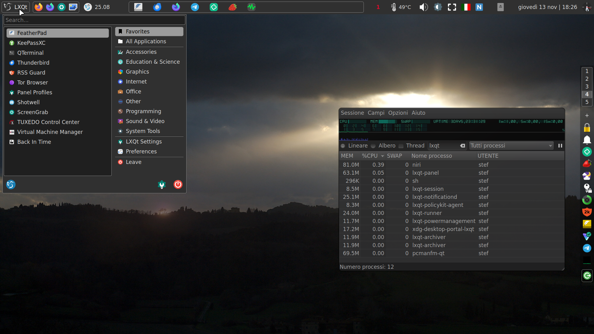

# niri-dotfiles
> Niri scripts, hacks and dotfiles with LXQt 2.3

Screenshot (external monitor -laptop monitor is just browser and RSS and no panel):

* PCManFM-Qt's desktop can hide items (if any) using right click menu, so it can act as a wallpaper daemon (with slides evt.), while overview will use swaybg.
* Panel with custom commmand widgets:
  * Show running compositor/Wm (scripts/desktopinfo), launches "Session Settings"
  * Coredumps count
  * CPU temp
  * Toggle brightness in steps for HDMI-A-1 (scripts/dim.sh)
  * Keyboard layout indicator (scripts/kbd-plugin)
  * NumLock indicator (scripts/numlock-indicator
  * Analog clock (https://github.com/lxqt/lxqt/discussions/2179#discussioncomment-14628471)
* Screenrecorder shortcuts (Meta+Print, Meta+Shift+Print to stop, using wf-recorder)
* Shortcut for detect Xwayland apps (Meta+X)
* Wooz for zoom (Meta+Z)
* "Translate any selected text" shortcut and show it as notification (Meta+N;  scripts/translate)
* Script to switch panel configuration (laptop|dual monitor)
